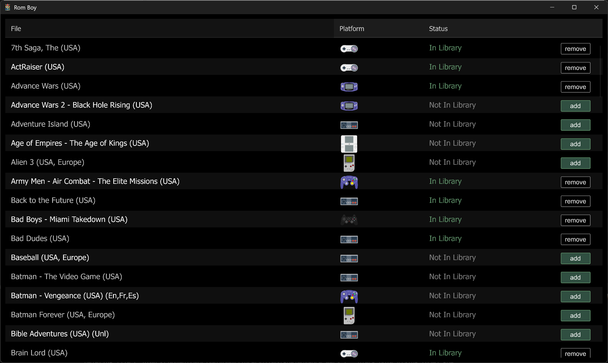

extracts roms from [zip files](https://myrient.erista.me/files/), and puts them in your library under the correct platform

 

## Quick Start

* Download the [latest release](https://github.com/jaymedavis/romboy/releases)

* * Open `settings.toml` and set `zips` and `roms` under `[path]`.
    - zips is where your downloaded roms are (e.g. _~/Downloads/rom_zips_)
    - roms is the location of your rom library.  This could be your [RomM Library](https://romm.app), syncthing library, or an SD card.  

For now, the path is expected to be in the `roms/platform/game` format.  e.g.  roms/nes/Legend of Zelda, The.nes

## Logging

the app logs to the file `logs/app.log`. If you'd rather see the logs in a terminal (or for a dev environment), change `mode` in `settings.toml` to `stdout`.  

The log `level` can be set to `Off`, `Error`, `Warn`, `Info`, `Debug`, `Trace`

## Run Source

* [Install Rust](https://rustup.rs/)

* ``cargo run``

 

## v0.1.0

